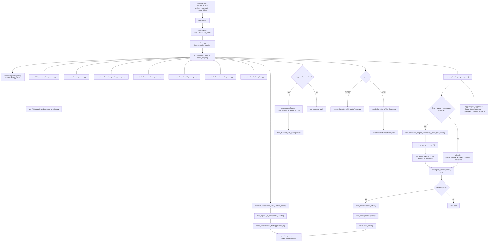

# Dhan-Codebase Project Flow Chart (Current)

This file maps the **current** runtime architecture using real file names from the codebase.

## 1) Module separation (by folder)

```mermaid
flowchart TB
    subgraph Entry["Entry + Job Selection"]
      A["run/main.py<br/>parse --venue, build EngineConfig, run jobs"]
      B["run/config.py<br/>STRATEGY_JOBS, RUN_MODE"]
      C["run/engine_config.py<br/>EngineConfig + logging setup"]
    end

    subgraph Engine["Engine Orchestration"]
      D["core/engine/factory.py<br/>wire strategy, data, broker, feeds"]
      E["core/engine/live_engine.py<br/>live loop + strategy execution"]
      F["core/engine/live_engine_common.py<br/>shared helpers, tick drain"]
      G["core/engine/backtest_engine.py"]
      H["core/engine/base_engine.py"]
      I["core/engine/supervisor.py<br/>optional multi-engine"]
    end

    subgraph Strategy["Strategy Layer"]
      J["core/strategies/registry.py<br/>name -> strategy class"]
      K["core/strategies/base.py"]
      L["core/strategies/MagicalLines/NiftyIntradayMagicalLine.py"]
      M["core/strategies/Leaps/LeapsQuatery_RSI_52_32.py"]
      N["core/strategies/Equity/IPOBreakout/IPOBreakout.py"]
    end

    subgraph Data["Data Layer"]
      O["core/data/sources/dhan_source.py"]
      P["core/data/sources/delta_source.py"]
      Q["core/data/datalayer/dhan_data_provider.py"]
      R["core/data/datalayer/delta_data_provider.py"]
      S["core/data/candle_service.py"]
      T["core/data/candle_aggregator.py"]
      U["core/data/feeds/dhan_feed.py"]
      V["core/data/feeds/delta_feed.py"]
      W["core/data/feeds/dhan_order_update_feed.py"]
      X["core/data/feeds/dhan_depth_feed.py"]
    end

    subgraph OMS["OMS + Risk + Positions"]
      Y["core/orderExecution/order_router.py"]
      Z["core/orderExecution/risk_manager.py"]
      AA["core/orderExecution/position_manager.py"]
      AB["core/orderExecution/intent_store.py"]
    end

    subgraph Broker["Broker Adapters"]
      AC["core/broker/internal/dhan/broker.py"]
      AD["core/broker/internal/dhan/api.py"]
      AE["core/broker/internal/delta/broker.py"]
      AF["core/broker/internal/simulated/broker.py"]
    end

    subgraph Logging["Logging + Reports"]
      AG["logger/engine_logger.py"]
      AH["logger/trade_logger.py"]
      AI["logger/open_positions_logger.py"]
      AJ["core/analytics/performance.py"]
      AK["core/analytics/quarterly_report.py"]
    end

    A --> D
    B --> A
    C --> A
    D --> E
    D --> G
    D --> J
    D --> Q
    D --> R
    D --> S
    D --> U
    D --> V
    D --> W
    D --> Y
    D --> AC
    D --> AE
    D --> AF
    E --> L
    E --> M
    E --> N
    E --> F
    E --> AG
    Y --> Z
    Y --> AA
    Y --> AB
    Y --> AC
    Y --> AE
    Y --> AF
    AC --> AD
    D --> I
    E --> AH
    E --> AI
    E --> AJ
    E --> AK
    U --> T
    V --> T
```

## 2) End-to-end runtime flow (DHAN live/paper)

## 3) Practical boundaries (how modules are separated)

- `run/` = process entry, CLI args, job config to `EngineConfig`.
- `core/engine/` = lifecycle + orchestration; owns the runtime loop.
- `core/data/` = market data acquisition (REST + websocket + candle build).
- `core/strategies/` = signal generation only (returns intents).
- `core/orderExecution/` = intent handling, risk checks, order/position state.
- `core/broker/internal/*` = venue-specific broker API translation.
- `logger/` + `core/analytics/` = observability and post-trade reporting.

## 4) Notes for current repo state

- Tick queue + `CandleAggregator` are enabled only when strategy has `timeframe`.
- Active DHAN jobs can run in `PAPER` mode while still using live websocket feed.
- `PROJECT_STRUCTURE.md` contains older paths and should be treated as legacy notes.
