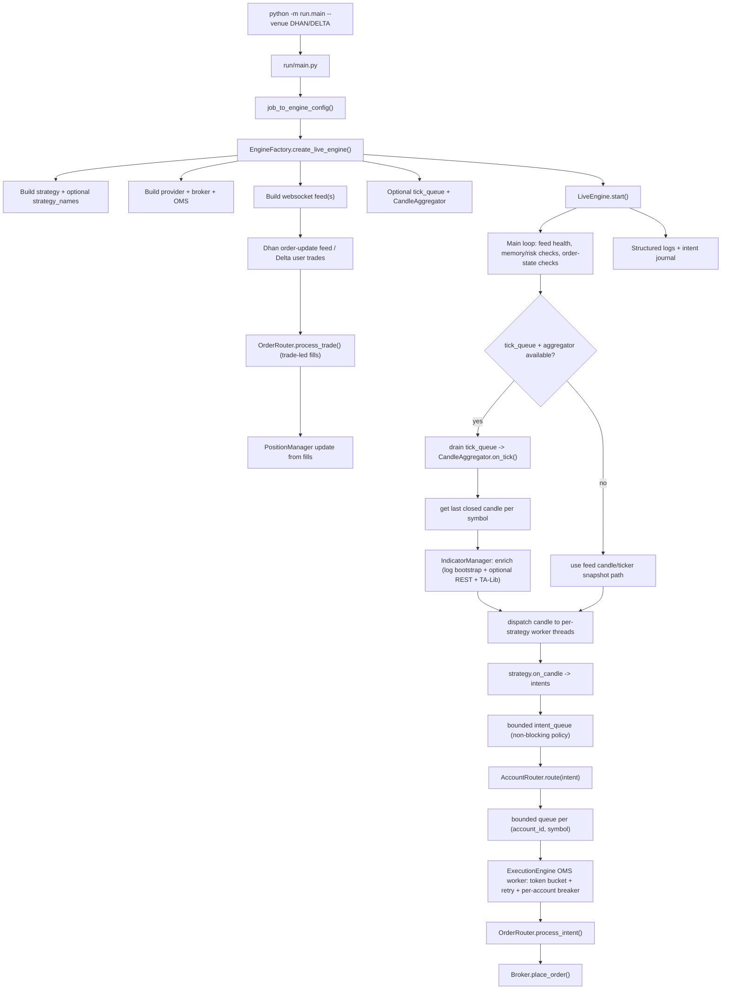
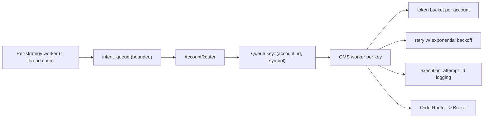
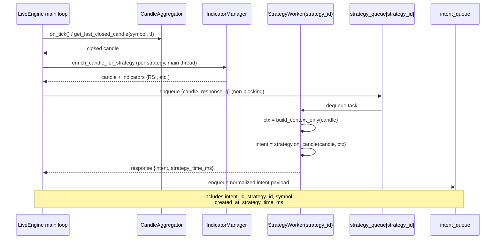
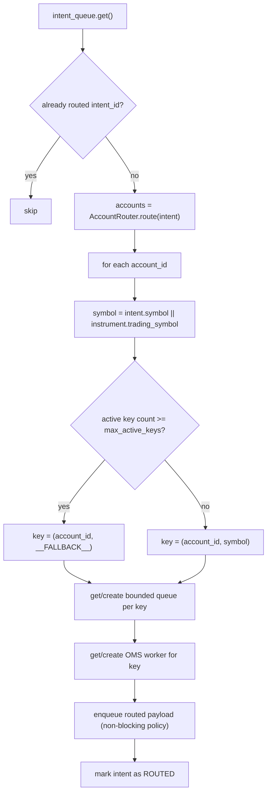
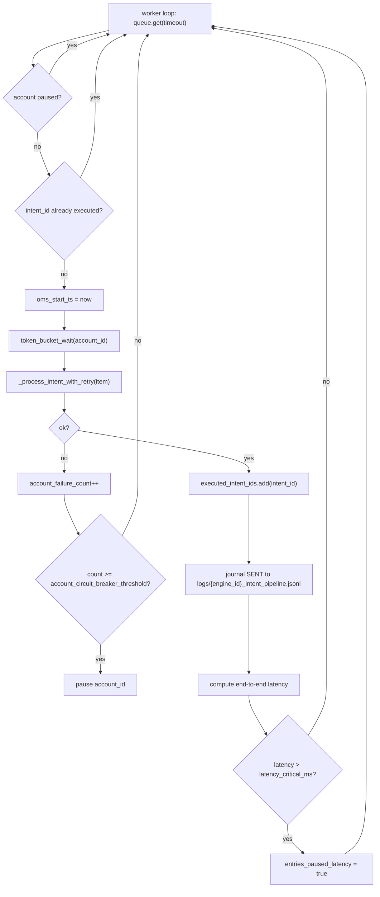
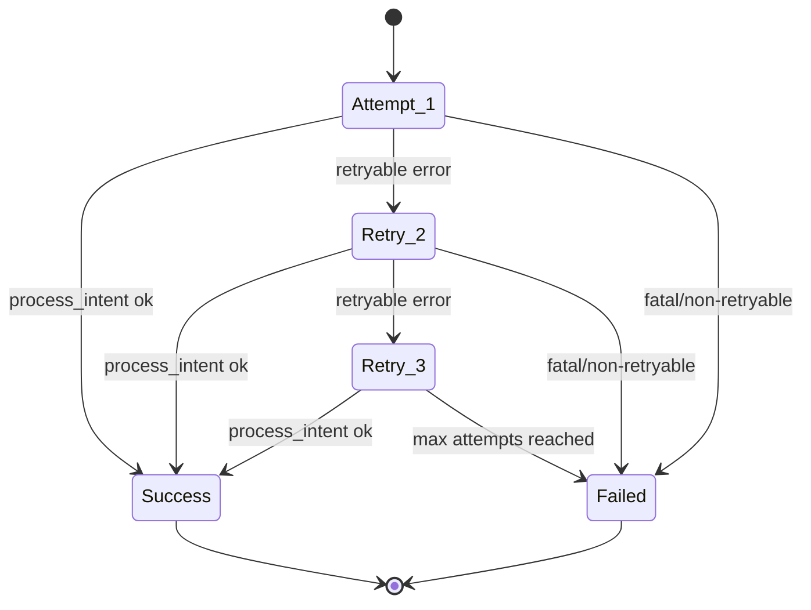
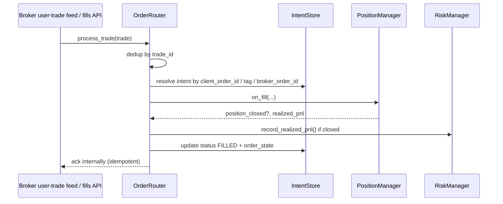
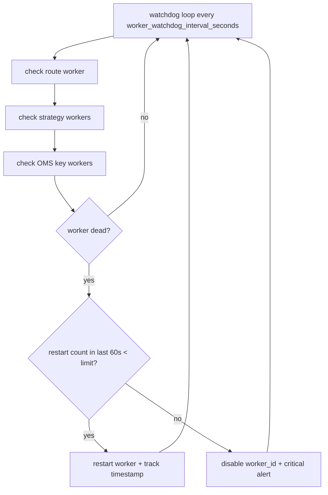

# Project Flow Chart (Current Runtime)

This file documents the **current** execution flow using actual module names.

## 1) Module Map

```mermaid
flowchart TB
    subgraph Entry["Entry + Config"]
      A["run/main.py"]
      B["run/config.py (ENGINE_JOBS, RUN_MODE)"]
      C["run/engine_config.py (EngineConfig)"]
    end

    subgraph Orchestration["Engine Orchestration"]
      D["core/engine/factory.py"]
      E["core/engine/live_engine.py"]
      EE["core/engine/execution_engine.py"]
      IND["core/engine/indicator_manager.py"]
      F["core/engine/backtest_engine.py"]
      G["core/engine/base_engine.py"]
      H["core/engine/supervisor.py"]
    end

    subgraph Strategies["Strategies"]
      I["core/strategies/registry.py"]
      J["core/strategies/base.py"]
      K["core/strategies/*"]
    end

    subgraph Data["Data + Feeds"]
      L["core/data/sources/*"]
      M["core/data/datalayer/*"]
      CS["core/data/candle_service.py"]
      N["core/data/candle_aggregator.py"]
      O["core/data/feeds/dhan_feed.py"]
      P["core/data/feeds/delta_feed.py"]
      Q["core/data/feeds/dhan_order_update_feed.py"]
    end

    subgraph OMS["OMS + Risk + Routing"]
      R["core/orderExecution/intent_store.py"]
      S["core/orderExecution/risk_manager.py"]
      T["core/orderExecution/position_manager.py"]
      U["core/orderExecution/account_router.py"]
      V["core/orderExecution/order_router.py"]
    end

    subgraph Broker["Broker Adapters"]
      W["core/broker/internal/dhan/*"]
      X["core/broker/internal/delta/*"]
      Y["core/broker/internal/simulated/broker.py"]
    end

    subgraph Logs["Observability"]
      Z["utils/logger/engine_logger.py"]
      ZA["utils/logger/trade_logger.py"]
      ZB["utils/logger/open_positions_logger.py"]
    end

    B --> A
    C --> A
    A --> D
    D --> E
    D --> F
    D --> I
    D --> L
    D --> M
    D --> CS
    D --> O
    D --> P
    D --> Q
    D --> U
    D --> V
    D --> W
    D --> X
    D --> Y
    E --> EE
    E --> IND
    EE --> V
    IND --> M
    E --> N
    E --> CS
    E --> K
    V --> R
    V --> S
    V --> T
    E --> Z
    E --> ZA
    E --> ZB
    D --> H
    E --> G
    F --> G
```

## 2) Live Runtime Flow (Feed-Driven)

## 3) OMS Detail (ExecutionEngine + threaded fanout)

`LiveEngine` delegates routing, per-account-symbol queues, OMS workers, token bucket, retries, and the watchdog to `core/engine/execution_engine.py`.

## 4) Operational Boundaries

- `run/` handles process entry, CLI and job -> `EngineConfig` (`run/main.py` reads `ENGINE_JOBS` from `run/config.py`; `job_to_engine_config()` accepts the legacy multi-key job shape too).
- `run/option_buildup_scheduler.py`, `run/dummy_live.py`, and `run/run_quarterly_report.py` are **standalone** entrypoints (not started by `run.main`).
- `core/engine/` owns orchestration and lifecycle (`factory`, `live_engine`, `backtest_engine`, `execution_engine`, `indicator_manager`, `supervisor`).
- `core/engine/base_engine.py` wires `DataRouter` + `OptionChainService` into `StrategyContext` for option-chain strategies.
- `core/data/` owns sources, providers, websocket feeds, `CandleService`, and candle aggregation.
- `core/strategies/` owns signal generation (`on_candle`).
- `core/orderExecution/` owns intent lifecycle, risk, routing, position state.
- `core/broker/internal/*` maps orders/fills to broker APIs.
- `utils/logger/` and `core/analytics/` handle telemetry and reporting.

## 5) Current Notes

- Live **candle delivery** is feed- or aggregator-driven (`DhanWebSocketFeed` / `DeltaWebSocketFeed`, optional `tick_queue` + `CandleAggregator`). `core/data/feeds/dummy_feed.py` is used by `run/dummy_live.py`.
- **`IndicatorManager`** (live) bootstraps history from engine `*_candles.log` when valid; if logs are missing, short, or invalid it may call **`IDataProvider.get_intraday`** (REST / broker historical path) before the first live bar — this is separate from the tick loop.
- Optional **log-only bootstrap** for LEAPS-style setups: regenerate `logs/...` via `utils/seed_leaps_bootstrap_logs.py` (frozen Yahoo tail in `utils/leaps_bootstrap_yf_reference.py`); `utils/yfinance_nifty_rsi.py` is a manual fetch helper, not imported by the engine.
- `PAPER` uses live data path with simulated execution.
- Multi-strategy live mode runs one worker thread per strategy.
- Queue growth is bounded at strategy, intent, and account-symbol stages.

## 6) LLD - Candle to Intent Path

## 7) LLD - Intent Routing and Ordering

## 8) LLD - OMS Worker Path (Per Account-Symbol Key)

## 9) LLD - Retry State Machine

## 10) LLD - Trade-Led Fill Update Path

## 11) LLD - Watchdog and Worker Recovery

sequenceDiagram
    participant Main as Main loop
    participant SW as strategy_worker
    participant RS as _run_strategy
    participant PE as _process_entry_like_intent
    participant Q as intent_queue
    participant Router as route_intents_worker
    participant OMS as account_symbol OMS worker
    participant Broker as order_router / broker

    Main->>SW: task on strategy queue
    SW->>SW: on_candle → [OrderIntent]
    SW->>Main: response_q.put(intent, ctx, ...)
    Main->>RS: _run_strategy(...)
    RS->>PE: for each entry intent
    PE->>PE: risk, hours, dedupe, depth price
    PE->>Q: _enqueue_intent
    Router->>OMS: route by account/symbol
    OMS->>Broker: process_intent (LIMIT BUY)
    Broker-->>Main: fill → position_manager

