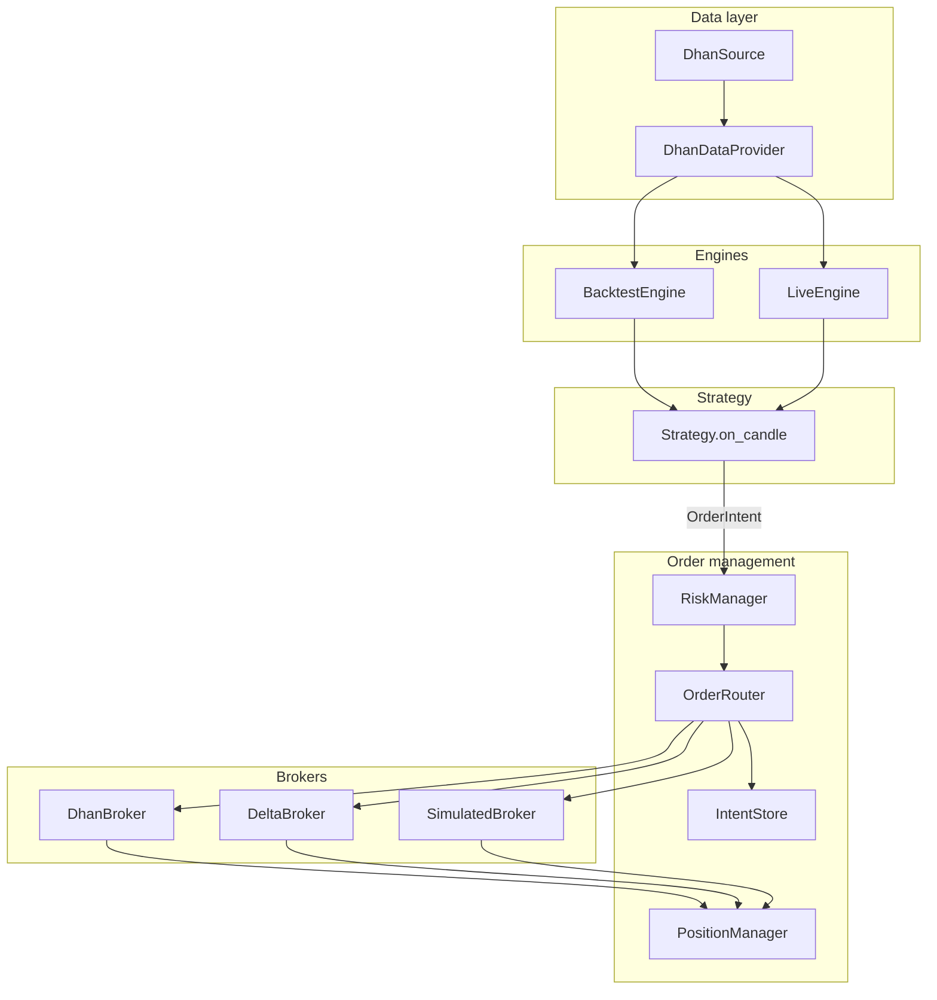

# Dhan Algo Trading – Project Overview

Algo trading codebase with **backtest** and **live/paper** modes. Strategies (e.g. LEAPS RSI, Inside Bar) run on **engines** fed by a **data layer**; orders go through **order management** and **brokers** (Dhan, Delta stub, Simulated).

---

## High-Level Flow

```
┌─────────────────────────────────────────────────────────────────────────────────┐
│                              DATA LAYER                                           │
│  (LTP, Candles, Option Chain, Expiries – no orders)                               │
│  IDataProvider ← DhanDataProvider(DhanSource)                                     │
└──────────────────────────────┬──────────────────────────────────────────────────┘
                                │
                                ▼
┌─────────────────────────────────────────────────────────────────────────────────┐
│                              ENGINES                                             │
│  BacktestEngine | LiveEngine                                                     │
│  • Pull candles / context from Data Provider                                     │
│  • Build context (option_chain_service, position_store, instrument_store)        │
│  • Strategy.on_candle(candle, ctx) → OrderIntent(s)                              │
└──────────────────────────────┬──────────────────────────────────────────────────┘
                                │
                                ▼
┌─────────────────────────────────────────────────────────────────────────────────┐
│                         ORDER MANAGEMENT                                         │
│  RiskManager → OrderRouter → Broker.place_order(intent, execution_price)          │
│  IntentStore (CREATED → SENT → FILLED/REJECTED)                                 │
│  PositionManager (on_fill, reconcile, get_open_positions)                        │
└──────────────────────────────┬──────────────────────────────────────────────────┘
                                │
                                ▼
┌─────────────────────────────────────────────────────────────────────────────────┐
│                              BROKERS                                             │
│  DhanBroker(DhanBrokerApi) | DeltaBroker(DeltaBrokerApi) | SimulatedBroker       │
│  place_order / exit_position / get_positions / get_order_list                    │
└─────────────────────────────────────────────────────────────────────────────────┘
```

### Mermaid flowchart (for GitHub / docs)



---

## 1. How Engines Get Their Feed

Engines **never** talk to the exchange or broker directly for **market data**. All feed comes from the **data layer**.

| Feed type        | Source                    | Used by |
|------------------|---------------------------|--------|
| **Candles (OHLC)** | `data_provider.get_intraday()` (backtest) / `CandleService.get_latest_closed()` (live) | BacktestEngine, LiveEngine |
| **LTP / latest**   | `data_provider.get_latest_candles()` | LiveEngine (tick mode) |
| **Option chain**   | `option_chain_service.get_chain()` → **DataRouter** → NSE/Dhan **adapters** → `data_provider.get_live_option_chain()` or `get_nse_optionchain_historical()` / `get_expired_optionchain()` | Strategies (e.g. IndiaMktMixins) |
| **Expiry list**    | Same path: adapters call `data_provider.get_live_expiry()` or `get_nse_expiries()` | OptionChainService, ExpiryResolver |

- **Backtest:** `BacktestEngine` gets a DataFrame from `data_provider.get_intraday(...)` and iterates candle-by-candle; context includes `option_chain_service` and `position_store`.
- **Live/Paper:** `LiveEngine` uses `CandleService(data_provider)` for the latest closed candle (or `data_provider.get_latest_candles()` in tick mode). Same context building as backtest.

So: **data layer (IDataProvider) → engines and OptionChainService**. Order placement is separate (broker layer).

---

## 2. Order Management System

| Component         | Role |
|------------------|------|
| **OrderIntent**  | Immutable intent (instrument, side, qty, price, strategy, structure_id, tag, etc.). Created by strategy. |
| **IntentStore**  | Tracks intent lifecycle: CREATED → SENT → FILLED / REJECTED. Used for idempotency and audit. |
| **RiskManager**  | Decides if an intent is allowed (position limits, exposure, daily loss, duplicate prevention). Rejected intents never reach the broker. |
| **OrderRouter**   | Takes an intent + price_map; runs risk check, applies slippage, calls `broker.place_order(intent, execution_price)`, updates IntentStore. |
| **PositionManager** | Holds positions; `on_fill()` updates state; `get_open_positions()`, `get_hedge_for()`, `has_open_structure()` for strategies. Rollover/structure-exit callback wired from engine. |

Flow: **Strategy → OrderIntent → RiskManager.allow_intent() → OrderRouter.process_intent() → Broker.place_order() → (on fill) PositionManager**.

---

## 3. Brokers

| Broker            | Use case     | API / backing |
|-------------------|-------------|----------------|
| **DhanBroker**    | Live / Paper | **DhanBrokerApi** wraps DhanSource (place_order, get_positions, get_order_list). |
| **DeltaBroker**   | Future      | **DeltaBrokerApi** (stub). Replace with real Delta Exchange API when going live on Delta. |
| **SimulatedBroker** | Backtest   | No real exchange; fills go to PositionManager with execution_price. |

- Brokers only do **order placement and position/order lookup**. They do **not** provide candles, option chain, or expiries; that stays in the data layer.
- In `run/main.py`, broker choice is controlled by `BROKER_NAME` ("DHAN" or "DELTA"). Data provider can stay Dhan/NSE until Delta has a data feed.

---

## 4. What Should Be Improved

| Area | Current gap | Suggested improvement |
|------|-------------|------------------------|
| **LiveEngine** | Hardcoded candle in one path; `create_exit_intent` vs `on_position_exit` inconsistency | Use real candle from CandleService everywhere; align exit API with BacktestEngine (e.g. `on_position_exit` returning list of intents). |
| **CandleService** | `pdb.set_trace()` left in code | Remove before live. |
| **DhanSource.place_order** | Return shape may not match `status` / `order_id` expected by DhanBrokerApi | Ensure Dhan/Tradehull response is normalized to `{"status": "success", "order_id": "..."}`. |
| **Instrument file** | `all_instrument{date}.csv` must exist for current date | Add download step (e.g. from Dhan) or fallback to last available file; document in run/README. |
| **RiskManager** | Basic checks | Add: max orders per minute, symbol/strategy exposure caps, daily P&amp;L limit, optional kill switch. |
| **Idempotency** | DhanBroker uses intent_id as tag; `find_order_by_client_id` uses get_order_list | Ensure get_order_list is implemented in DhanSource (Tradehull) and test duplicate-submit behaviour. |
| **Logging / alerts** | Scattered print statements | Centralise logging (e.g. TradeLogger) for intents, orders, fills, errors; add optional Telegram/email alerts for fills and failures. |
| **Config** | RUN_MODE and BROKER_NAME in code | Move to env or config file (e.g. .env) so live runs don’t require code edits. |
| **Delta Exchange** | Stub only | Implement real DeltaBrokerApi (auth, place_order, get_positions, get_order_list) and wire credentials securely. |

---

## 5. Next Plans to Take This to Live

1. **Stabilise live path**
   - Remove any `pdb`/debug code from CandleService and LiveEngine.
   - Use only CandleService (or get_latest_candles) for candles; remove hardcoded candle.
   - Unify exit flow: strategy exposes `on_position_exit` returning list of OrderIntents; LiveEngine uses same flow as BacktestEngine where applicable.

2. **Config and secrets**
   - Use `.env` for RUN_MODE, BROKER_NAME, Dhan credentials, and (later) Delta API keys.
   - Load in `run/config.py` and keep secrets out of repo.

3. **Instrument file**
   - Automate download of instrument file (e.g. daily from Dhan) or use last-known file with a clear warning in logs.

4. **Risk and safety**
   - Harden RiskManager (per-symbol/strategy limits, daily loss limit, order rate limit).
   - Optional kill switch to stop new orders and optionally flatten positions.

5. **Observability**
   - Log all intents, broker calls, and fills through one pipeline (e.g. TradeLogger).
   - Optional alerts (Telegram/email) on fill, reject, and critical errors.

6. **Broker readiness**
   - Confirm Dhan response format and get_order_list; fix DhanBrokerApi/DhanSource if needed.
   - For Delta: implement and test DeltaBrokerApi; then set BROKER_NAME = "DELTA" and use DeltaBroker.

7. **Paper run**
   - Run in PAPER mode with real data and simulated orders (or Dhan paper if available) for at least one full session before going live.

8. **Documentation**
   - Keep this README and PROJECT_STRUCTURE.md in sync; add runbook for starting/stopping live and handling holidays/expiries.

---

## Quick Start

```bash
# Install
pip install -r requirements.txt

# Configure run/config.py: RUN_MODE (BACKTEST | PAPER | LIVE), STRATEGY_JOBS
# Optionally .env for credentials and BROKER_NAME in main.py

# Backtest
python run/main.py

# Live/Paper: set RUN_MODE = RunMode.LIVE or RunMode.PAPER, then
python run/main.py
```

---

## Project Layout (summary)

```
core/
├── data/
│   ├── datalayer/          # IDataProvider, DhanDataProvider (feed for engines)
│   ├── sources/             # DhanSource, NSEClient
│   ├── adapters/            # NSE/Dhan adapters for option chain
│   ├── data_router.py       # NSE vs Dhan adapter selection
│   ├── option_chain_service.py
│   └── candle_service.py   # Latest closed candle (live)
├── engine/
│   ├── base_engine.py      # build_context, strategy.on_candle
│   ├── backtest_engine.py  # Candle loop, exits, rollover, entry
│   └── live_engine.py     # Live loop, candle/tick mode
├── broker/                  # Order placement only
│   ├── broker_api.py       # IBrokerApi
│   ├── dhan_broker_api.py / dhanbroker.py
│   ├── delta_broker_api.py / delta_broker.py
│   └── simulated_broker.py
├── orderExecution/
│   ├── order_router.py     # process_intent → risk → broker
│   ├── risk_manager.py
│   ├── intent_store.py
│   └── position_manager.py
├── strategies/              # LEAPS, Inside Bar, IndiaMktMixins, etc.
└── ...
run/
├── config.py               # RUN_MODE, STRATEGY_JOBS
└── main.py                 # Wire data_provider, broker, engine, order_router
```

For more detail on intent flow and risk, see `core/orderExecution/README.md` and `core/broker/README.md`.
