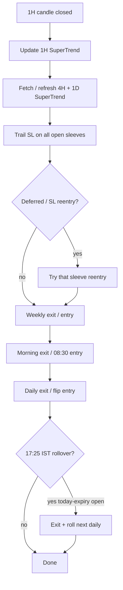
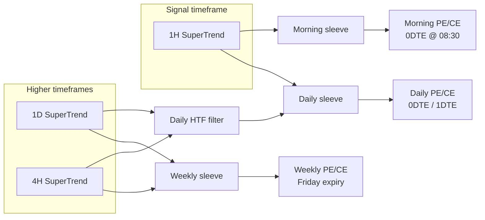
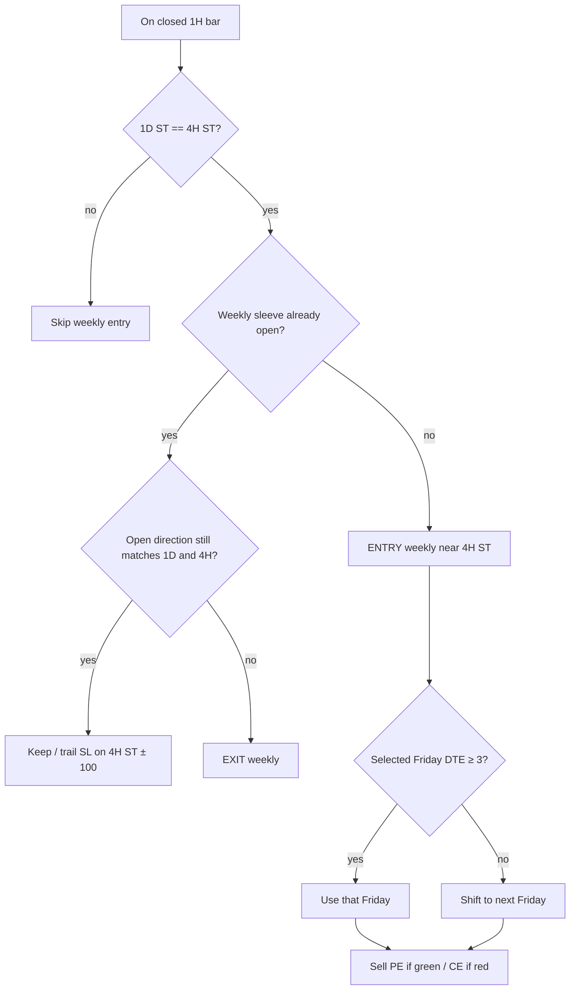
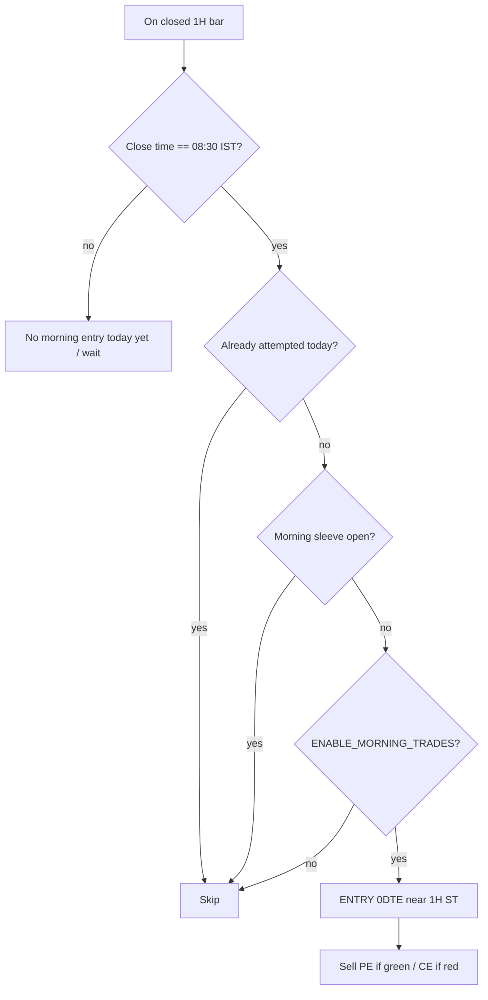

# DirectionalOptionSelling

BTC SuperTrend **directional option selling** on Delta Exchange.

Sells puts when bullish, sells calls when bearish. Runs **four sleeves in parallel** (each can be open at the same time):

| Sleeve | `structure_id` token | Enable switch |
|--------|----------------------|---------------|
| **Weekly** | `weekly` | `ENABLE_WEEKLY_TRADES` |
| **Monthly** | `monthly` | `ENABLE_MONTHLY_TRADES` |
| **Daily** | `daily` | `ENABLE_INTRADAY_TRADES` |
| **Morning** | `morning` | `ENABLE_MORNING_0DTE_TRADES` |

When a switch is `False`, that sleeve takes **no new entries and no SL re-entries**. Open positions still trail SL, force-exit, reverse, and roll as usual.

---

## Layout

| File | Owns |
|------|------|
| `DirectionalOptionSelling.py` | Strategy lifecycle (entry/exit/rollover/eval) |
| `htf.py` (`DosHtfMixin`) | 1D/4H SuperTrend fetch, cache, entry alignment |
| `trail_sl.py` (`DosTrailSlMixin`) | Broker MAIN_SL trail levels, modify, pending retry |
| `constants.py` | Shared knobs (ST params, trail points, sleeves) |

---

## Direction map (all sleeves)

| SuperTrend | Meaning | Action |
|------------|---------|--------|
| **Green** (`+1`) | Bullish | Sell **PE** (put) |
| **Red** (`-1`) | Bearish | Sell **CE** (call) |

SuperTrend params: length **16**, factor **1.5**.

---

## Sleeve comparison (lifecycle)

| Topic | Weekly | Monthly | Daily | Morning |
|-------|--------|---------|-------|---------|
| **Enable flag** | `ENABLE_WEEKLY_TRADES` | `ENABLE_MONTHLY_TRADES` | `ENABLE_INTRADAY_TRADES` | `ENABLE_MORNING_0DTE_TRADES` |
| **Lots** | `ORDER_QTY_LOTS_WEEKLY` (50) | Same as weekly | `ORDER_QTY_LOTS_DAILY` (10) | `ORDER_QTY_LOTS_MORNING` (10) |
| **When it can enter** | On **closed 4H bar**, while 1D + 4H already agree | On closed 1H bar, **only** on a confirmed **1D ST flip** | On closed 1H bar, **only** on a confirmed **1H ST flip** | Once per day on the **09:30 IST** closed 1H bar |
| **Signal / direction** | Color of aligned 1D + 4H | New 1D SuperTrend after flip | Confirmed 1H SuperTrend after flip | Current confirmed 1H SuperTrend (no flip required) |
| **HTF filter (1D + 4H)** | **Required** (1D must equal 4H) | **None** (flip is the filter) | **Required** (both must match 1H direction) | **None** — 1H only |
| **Strike reference ST** | **4H** SuperTrend | **4H** SuperTrend | **1H** SuperTrend | **1H** SuperTrend |
| **Expiry** | Friday weekly; if DTE ≤ 2 → next Friday (min DTE **3**) | Monthly last Friday; if DTE &lt; **7** → next month | Before 17:25 IST → **0DTE**; at/after → **1DTE** | Always prefer **today 0DTE** |
| **Qty / premium** | OTM, outside ST, premium ≥ **$120**; deeper OTM if enabled | Same as weekly | Same (≥ **$120**); also `|strike−spot| ≥ **400**` | Same rules, premium ≥ **$20**; also `|strike−spot| ≥ **400**` |
| **Duplicate guard** | No open weekly sleeve; skip if same Friday already open | No open monthly sleeve; skip if same expiry already open | No open daily sleeve; skip if same contract already open | No open morning sleeve; skip if same 0DTE expiry already open |
| **Entry reason tag** | `weekly_htf_aligned` | `one_d_signal` | `one_h_signal` | `morning_830` |

---

## Exits by sleeve

| Exit type | Weekly | Monthly | Daily | Morning |
|-----------|--------|---------|-------|---------|
| **Signal / regime exit** | 1D **or** 4H no longer matches open weekly direction → `MAIN_EXIT` (`weekly_htf_misaligned`) | Confirmed **1D ST flip** against open monthly → `MAIN_EXIT` (`one_d_reversal`) | Confirmed **1H ST flip** against open daily direction → `MAIN_EXIT` (`one_h_reversal`) | Confirmed **1H ST flip** against open morning direction → `MAIN_EXIT` (`morning_one_h_reversal`) |
| **Broker trail SL** | Starts at **2× entry premium**; switches once to **4H ST ± 100** when green + ST favorable | Same as weekly (4H) | Same → **1H ST ± 100** | Same → **1H ST ± 100** |
| **Force exit (strategy)** | Spot hits **4H ST ± 300** → LIMIT exit | Same (4H) | Spot hits **1H ST ± 300** → LIMIT exit | Spot hits **1H ST ± 300** → LIMIT exit |
| **Strike proximity** | Spot within **±50** of option strike → LIMIT exit | Same | Same | Same |
| **17:25 IST rollover** | Only if holding **today’s** daily expiry (unusual for weekly Friday) → exit + next daily | Unlikely (monthly expiry) | If holding **today’s** expiry → exit + roll next day (≥ 200 pts from ST) | If still open on **today’s** 0DTE → **flat EXIT only** (`morning_0dte_flat`) — **no** next-expiry roll |
| **Mid-bar / flicker** | Ignores unconfirmed 1H flicker; weekly cares about HTF | 1D flip seen on next closed 1H after HTF refresh | 1H flip needs **close confirmation** on new side of ST | Same close-confirmation rule as daily |

After a signal exit (`MAIN_EXIT`), the sleeve usually **transitions**: cancel resting `MAIN_SL`, exit, then re-open in the new direction for **that same sleeve** (if its enable flag is on).

---

## SL / force-exit reentry by sleeve

After broker `MAIN_SL` fill, strategy force-exit, or other full close that arms reentry:

| Step | Weekly | Monthly | Daily | Morning |
|------|--------|---------|-------|---------|
| **Arm** | `_arm_sl_reentry(..., sleeve=weekly)` | `sleeve=monthly` | `sleeve=daily` | `sleeve=morning` |
| **When it fires** | Next **closed 4H bar** after the exit time | Next **closed 1H bar** after the exit time | Same | Same |
| **Direction** | Prefer live **4H** direction if known; else current 1H | Prefer live **1D** direction if known; else current 1H | Current confirmed **1H** | Current confirmed **1H** |
| **HTF on reentry** | Must still pass weekly 1D+4H align inside `_build_entry` | No continuous align (flip-only sleeve) | Must still pass daily 1D+4H vs 1H filter | **No** HTF check |
| **Expiry on reentry** | Weekly Friday (DTE ≥ 3) | Monthly last Friday (DTE ≥ 7) | 0DTE / 1DTE via clock (≥ 17:25 → 1DTE) | Force **0DTE** (`min_dte=0`) |
| **Gated by** | `ENABLE_WEEKLY_TRADES` | `ENABLE_MONTHLY_TRADES` | `ENABLE_INTRADAY_TRADES` | `ENABLE_MORNING_0DTE_TRADES` |
| **Reason tags** | `sl_reentry_same` / `sl_reentry_flip` | Same | Same |

If the enable flag is off, the sleeve **exits only** (no re-entry / no transition re-open).

---

## Risk controls (shared, applied per open sleeve)

| Rule | Level | Reference ST | Who fires |
|------|-------|--------------|-----------|
| Trail SL | **2× entry** mark, then ST ± **100** | Weekly → **4H**; Daily / Morning → **1H** (after premium→index switch) | Broker `MAIN_SL`. Premium while red/flat; one-way switch to spot trail when green + ST favorable. Modify failures log `TRAIL_SL_STALE` and retry. |
| Force exit | ST ± **300** | Same sleeve ST as above | Strategy on quote / candle |
| Strike proximity | Spot within ± **50** of strike | Option strike | Strategy |
| Expiry rollover | **17:25 IST** | Any open **today** expiry | Daily/weekly: exit + next daily (min **200** pts from ST). **Morning: flat exit only** (no roll). |

---

## High-level flow (closed 1H bar)



---

## Three-sleeve overview



---

## Weekly sleeve detail

### Entry
1. **1D** and **4H** SuperTrend are the **same color**.
2. No open weekly position yet.
3. Sell near **4H SuperTrend** (OTM, outside ST, premium ≥ $120).
4. Expiry = next Friday weekly; if DTE &lt; 3, use **next** Friday.
5. Lots = `ORDER_QTY_LOTS_WEEKLY`.

### Exit / manage
- Exit when **1D or 4H** no longer matches open weekly direction.
- Trail broker SL on **4H ST ± 100**.
- Force exit on **4H ST ± 300** or strike ± 50.



---

## Daily sleeve detail (0DTE / 1DTE)

### Entry
1. Confirmed **1H SuperTrend flip only** (no mid-regime catch-up).
2. Filter: 1D and 4H must both match the new 1H direction.
3. Sell near **1H SuperTrend**.
4. Before **17:25 IST** → 0DTE; at/after → 1DTE.
5. Lots = `ORDER_QTY_LOTS_DAILY`.

### Exit / manage
- Exit on confirmed **1H flip** against the position.
- Trail on **1H ST ± 100**; force on **1H ST ± 300** or strike ± 50.


---

## Morning sleeve detail (08:30 IST 0DTE)

### Entry
1. Closed 1H bar whose close time is **08:30 IST** (once per calendar day).
2. Direction = **current 1H SuperTrend** (no flip required; **no** 1D/4H filter).
3. Prefer **today’s daily expiry** (0DTE).
4. Sell near **1H SuperTrend** (OTM, outside ST, premium ≥ **$20**).
5. Lots = `ORDER_QTY_LOTS_MORNING` (10).
6. Gated by `ENABLE_MORNING_TRADES`.

### Exit / manage
- Exit on confirmed **1H flip** against the morning position (`morning_one_h_reversal`).
- Trail / force / proximity same as daily (**1H** ST).
- At **17:25 IST**, if still holding today’s 0DTE: **flat EXIT** (`morning_0dte_flat`) — cancel resting MAIN_SL and close; **do not** roll to next expiry.
- SL reentry (from broker SL / force earlier in the day) stays on the morning sleeve and still prefers 0DTE (when `ENABLE_MORNING_TRADES` is on). After the 17:25 flat exit there is no re-open.



---

## Strike selection (all sleeves)

1. Strictly **OTM** vs spot (CE above spot, PE below spot).
2. Strike on the **outer side of SuperTrend** (CE &gt; ST, PE &lt; ST).
3. Nearest eligible strike to that sleeve’s SuperTrend reference.
4. Sell premium (best bid / mark) **≥ $120** (weekly / daily) or **≥ $20** (morning).
5. Qty = sleeve lots (`ORDER_QTY_LOTS_WEEKLY` / `_DAILY` / `_MORNING`).

---

## Bar timing

- Evaluation TF: **60m (1H)**.
- Live: act only after the 1H bar is **fully closed** (not mid-bar).
- Mid-bar risk is covered by broker trail SL + quote force exits.
- 1H flips require **close confirmation** on the new side of SuperTrend (ignores flicker while close is still on the old side).
- Morning slot uses the bar that **closes at 08:30 IST** (Delta BTC 60m bars are typically `:30` IST-aligned).

---

## Parameters (`constants.py`)

| Constant | Value | Role |
|----------|-------|------|
| `SUPER_TREND_LENGTH` | 16 | ATR length |
| `SUPER_TREND_FACTOR` | 1.5 | ATR multiplier |
| `MIN_PREMIUM_USD` | 120 | Min sell premium (weekly / daily) |
| `MIN_PREMIUM_USD_MORNING` | 20 | Min sell premium (morning 08:30 sleeve) |
| `TRAIL_SL_POINTS` | 100 | Index-mode broker trail vs ST |
| `PREMIUM_SL_MULT` | 2.0 | Initial mark SL = entry × this |
| `FORCE_EXIT_POINTS` | 300 | Strategy emergency vs sleeve ST |
| `STRIKE_PROXIMITY_EXIT_POINTS` | 50 | Exit if spot near strike |
| `MIN_STRIKE_SPOT_DISTANCE` | 400 | Morning / daily ENTRY min \|strike−spot\| |
| `ROLLOVER_TIME` | 17:25 IST | Today-expiry rollover |
| `ROLLOVER_MIN_STRIKE_DISTANCE` | 200 | Min distance on rollover strike |
| `ORDER_QTY_LOTS_WEEKLY` | 10 | Weekly entry lots |
| `ORDER_QTY_LOTS_DAILY` | 10 | Daily entry lots |
| `ORDER_QTY_LOTS_MORNING` | 10 | Morning 08:30 entry lots |
| `MORNING_ENTRY_TIME` | 08:30 IST | Morning slot close time |
| `WEEKLY_MIN_DTE` | 3 | Weekly Friday must be ≥ 3 DTE |
| `MONTHLY_MIN_DTE` | 7 | Monthly last-Friday must be ≥ 7 DTE |
| `HTF_TIMEFRAMES` | `4h`, `1d` | Higher-TF SuperTrend sources |
| `SLEEVE_WEEKLY` / `MONTHLY` / `DAILY` / `MORNING` | `weekly` / `monthly` / `daily` / `morning` | Sleeve ids in `structure_id` |

Module switches in `DirectionalOptionSelling.py`:

| Switch | Default (as checked in) | Sleeve |
|--------|-------------------------|--------|
| `ENABLE_WEEKLY_TRADES` | `True` | weekly |
| `ENABLE_MONTHLY_TRADES` | `True` | monthly |
| `ENABLE_INTRADAY_TRADES` | `True` | daily |
| `ENABLE_MORNING_0DTE_TRADES` | `True` | morning |

---

## Entry / exit reason tags (logs / meta)

| Reason | Sleeve | Meaning |
|--------|--------|---------|
| `weekly_htf_aligned` | weekly | 1D + 4H agree → weekly entry |
| `weekly_htf_misaligned` | weekly | Exit: 1D/4H no longer agree with open weekly |
| `one_d_signal` | monthly | Confirmed 1D flip → monthly entry |
| `one_d_reversal` | monthly | Exit: 1D flipped against monthly position |
| `one_h_signal` | daily | Confirmed 1H flip + HTF filter pass |
| `one_h_reversal` | daily | Exit: 1H flipped against daily position |
| `morning_830` | morning | 08:30 IST clock-slot 0DTE entry |
| `morning_one_h_reversal` | morning | Exit: 1H flipped against morning position |
| `morning_0dte_flat` | morning | 17:25 IST flat exit of today’s 0DTE (no next-expiry roll) |
| `sl_reentry_same` / `sl_reentry_flip` | any | Post-SL reentry on next hour close |
| `expiry_rollover` | daily / weekly today-expiry | 17:25 IST roll to next daily |

---

## Indicator history refresh

Bootstrap / refresh 1h + 4h + 1d SuperTrend JSONL from Delta REST:

```bash
python utils/delta/refresh_crypto_indicator_history.py
# or explicitly:
python utils/delta/refresh_crypto_indicator_history.py --only 60,4h,1d
```

Writes:

- `logs/indicators/BTCUSD/60/indicator_history.jsonl`
- `logs/indicators/BTCUSD/4h/indicator_history.jsonl`
- `logs/indicators/BTCUSD/1d/indicator_history.jsonl`

## Files

| Path | Role |
|------|------|
| `DirectionalOptionSelling.py` | Strategy implementation |
| `test_directional_option_selling.py` | Unit tests |
| `readme.md` | This document |
