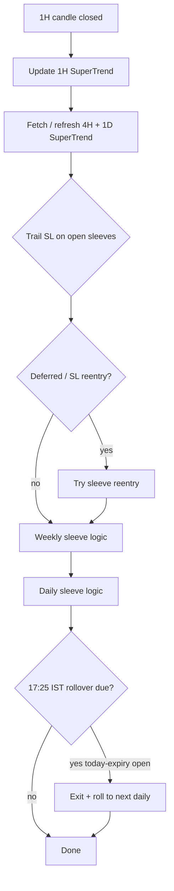
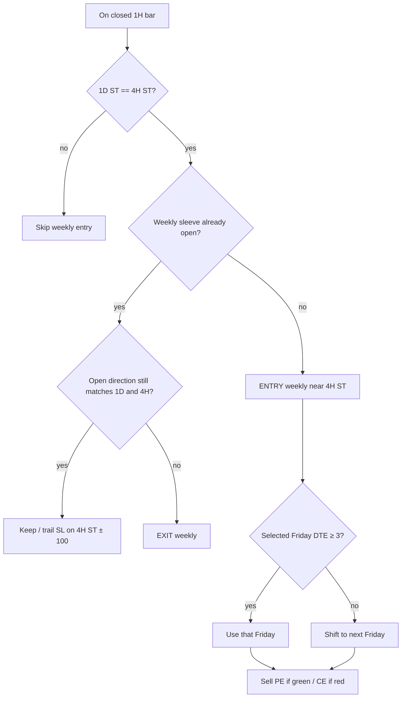
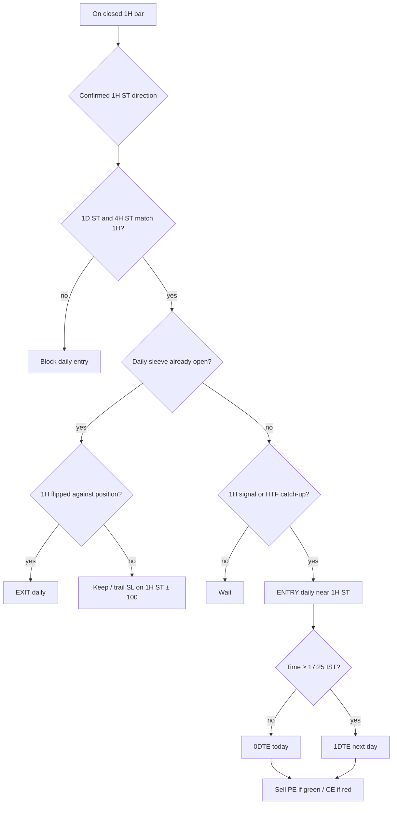
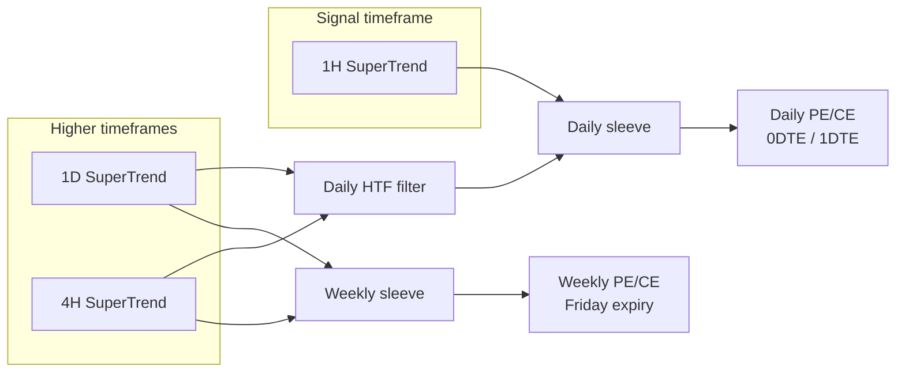
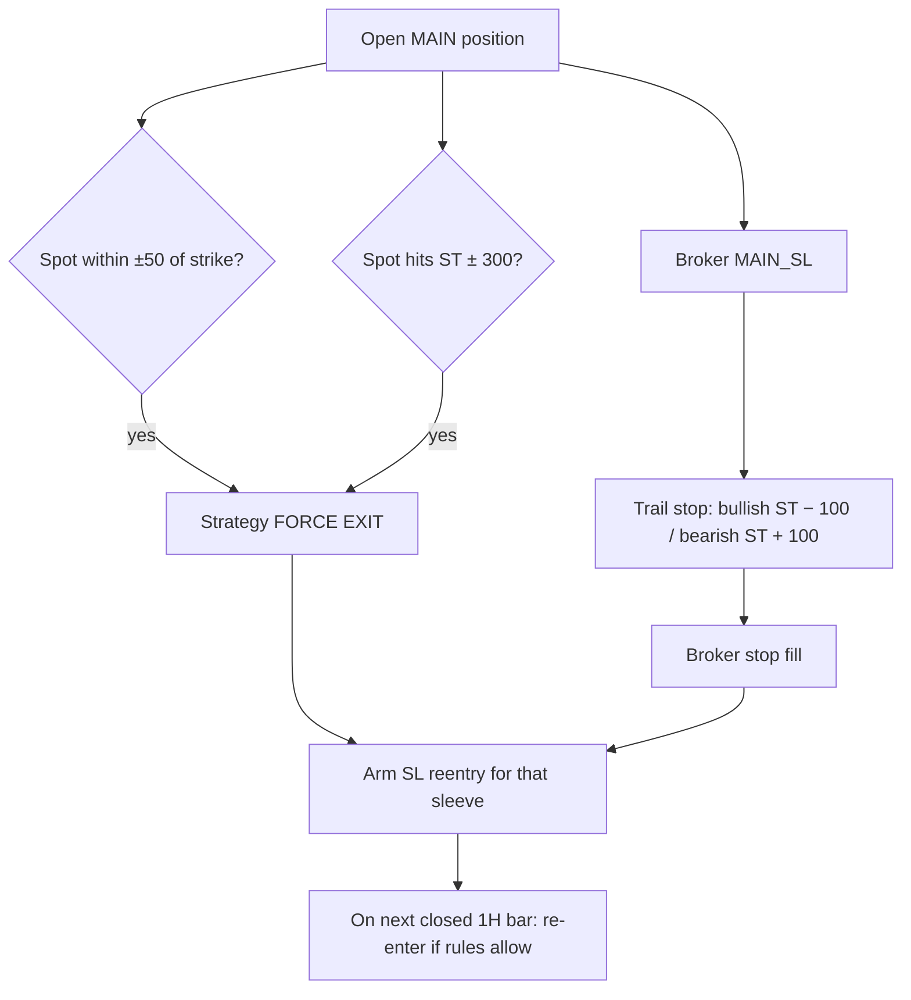

# DirectionalOptionSelling

BTC SuperTrend **directional option selling** on Delta Exchange.

Sells puts when bullish, sells calls when bearish. Runs **two sleeves in parallel**:

| Sleeve | Signal | HTF filter | Strike reference | Expiry |
|--------|--------|------------|------------------|--------|
| **Weekly** | 1D + 4H SuperTrend agree | same (1D + 4H) | 4H SuperTrend | Friday weekly (DTE ≥ 3) |
| **Daily** | 1H SuperTrend | 1D + 4H must match 1H | 1H SuperTrend | 0DTE / 1DTE |

Both sleeves may be open at the same time (one weekly + one daily).

---

## Direction map

| SuperTrend | Meaning | Action |
|------------|---------|--------|
| **Green** (`+1`) | Bullish | Sell **PE** (put) |
| **Red** (`-1`) | Bearish | Sell **CE** (call) |

SuperTrend params: length **16**, factor **1.5**.

---

## High-level flow



---

## Weekly sleeve

### Entry

1. **1D SuperTrend** and **4H SuperTrend** are the **same color**.
2. No open weekly position yet.
3. Sell near **4H SuperTrend** (OTM, outside ST, premium ≥ $120).
4. Expiry = next Friday weekly; if DTE &lt; 3 (i.e. ≤ 2 days), use **next** Friday.

### Exit

Exit weekly when **1D or 4H** no longer matches the open weekly direction.

### Flow



---

## Daily sleeve (0DTE / 1DTE)

### Entry

1. Driven by **1H SuperTrend** (flip signal, or flat catch-up while 1H side is already set).
2. Filter: for a **long (green / sell PE)**, **1D and 4H must both be green**; for **short (red / sell CE)**, **both must be red**.
3. Sell near **1H SuperTrend**.
4. Expiry:
   - Before **17:25 IST** → today (**0DTE**)
   - At/after **17:25 IST** → next day (**1DTE**)

### Exit

Exit daily on a confirmed **1H SuperTrend flip** against the open daily direction.

### Flow



---

## Dual-sleeve overview



---

## Strike selection

For both sleeves:

1. Strictly **OTM** vs spot (CE above spot, PE below spot).
2. Strike on the **outer side of SuperTrend** (CE &gt; ST, PE &lt; ST).
3. Nearest eligible strike to the sleeve’s SuperTrend reference.
4. Sell premium (best bid / mark) **≥ $120**.
5. Qty = **2 lots** (`ORDER_QTY_LOTS`).

---

## Risk & exits (all open sleeves)



| Rule | Level | Who fires |
|------|-------|-----------|
| Trail SL | ST ± **100** | Broker `MAIN_SL` (weekly uses 4H ST; daily uses 1H ST) |
| Force exit | ST ± **300** | Strategy (quote / candle) |
| Strike proximity | Spot within ± **50** of option strike | Strategy |
| Expiry rollover | **17:25 IST** if holding today’s expiry | Exit + re-enter next daily (≥ 200 pts from ST) |

After any SL / force / external full close: wait for the **next closed 1H bar**, then try to re-enter the **same sleeve** under current SuperTrend + HTF rules.

---

## Bar timing

- Evaluation TF: **60m (1H)**.
- Live: act only after the 1H bar is **fully closed** (not mid-bar).
- Mid-bar risk is covered by broker trail SL + quote force exits.
- 1H flips require **close confirmation** on the new side of SuperTrend (ignores flicker while close is still on the old side).

---

## Parameters (code constants)

| Constant | Value | Role |
|----------|-------|------|
| `SUPER_TREND_LENGTH` | 16 | ATR length |
| `SUPER_TREND_FACTOR` | 1.5 | ATR multiplier |
| `MIN_PREMIUM_USD` | 120 | Min sell premium |
| `TRAIL_SL_POINTS` | 100 | Broker trail vs ST |
| `FORCE_EXIT_POINTS` | 300 | Strategy emergency vs ST |
| `STRIKE_PROXIMITY_EXIT_POINTS` | 50 | Exit if spot near strike |
| `ROLLOVER_TIME` | 17:25 IST | Daily expiry rollover |
| `ROLLOVER_MIN_STRIKE_DISTANCE` | 200 | Min distance on rollover strike |
| `ORDER_QTY_LOTS` | 2 | Order size |
| `WEEKLY_MIN_DTE` | 3 | Weekly Friday must be ≥ 3 DTE |
| `HTF_TIMEFRAMES` | `4h`, `1d` | Higher-TF SuperTrend sources |

---

## Entry reason tags (logs / meta)

| Reason | Sleeve | Meaning |
|--------|--------|---------|
| `weekly_htf_aligned` | weekly | 1D + 4H agree → weekly entry |
| `weekly_htf_misaligned` | weekly | Exit: 1D/4H no longer agree |
| `one_h_signal` | daily | Confirmed 1H flip + HTF filter pass |
| `one_h_htf_aligned` | daily | Flat catch-up: 1H side + 1D/4H agree |
| `one_h_reversal` | daily | Exit: 1H flipped against position |
| `sl_reentry_same` / `sl_reentry_flip` | either | Post-SL reentry on hour close |
| `expiry_rollover` | daily (today expiry) | 17:25 IST roll |

---

## Indicator history refresh

Bootstrap / refresh 1h + 4h + 1d SuperTrend JSONL from Delta REST:

```bash
python utils/delta/refresh_crypto_indicator_history.py
# or explicitly:
python utils/delta/refresh_crypto_indicator_history.py --only 60,4h,1d
```

Writes:

- `logs/indicators/BTCUSD/60/indicator_history.jsonl`
- `logs/indicators/BTCUSD/4h/indicator_history.jsonl`
- `logs/indicators/BTCUSD/1d/indicator_history.jsonl`

## Files

| Path | Role |
|------|------|
| `DirectionalOptionSelling.py` | Strategy implementation |
| `test_directional_option_selling.py` | Unit tests |
| `readme.md` | This document |
