# Module Map

High-level package layout for the current runtime. See [README](README.md) for the full doc index.

```mermaid
flowchart TB
    subgraph Entry["Entry + Config"]
      A["run/main.py"]
      B["run/config.py (ENGINE_JOBS, RUN_MODE)"]
      C["run/engine_config.py (EngineConfig)"]
    end

    subgraph Orchestration["Engine Orchestration"]
      D["core/engine/factory.py"]
      E["core/engine/live_engine.py"]
      EE["core/engine/execution_engine.py"]
      IND["core/engine/indicator_manager.py"]
      F["core/engine/backtest_engine.py"]
      G["core/engine/base_engine.py"]
      H["core/engine/supervisor.py"]
    end

    subgraph Strategies["Strategies"]
      I["core/strategies/registry.py"]
      J["core/strategies/base.py"]
      K["core/strategies/*"]
    end

    subgraph Data["Data + Feeds"]
      L["core/data/sources/*"]
      M["core/data/datalayer/*"]
      CS["core/data/candle_service.py"]
      N["core/data/candle_aggregator.py"]
      O["core/data/feeds/dhan_feed.py"]
      P["core/data/feeds/delta_feed.py"]
      Q["core/data/feeds/dhan_order_update_feed.py"]
    end

    subgraph OMS["OMS + Risk + Routing"]
      R["core/orderExecution/intent_store.py"]
      S["core/orderExecution/risk_manager.py"]
      T["core/orderExecution/position_manager.py"]
      U["core/orderExecution/account_router.py"]
      V["core/orderExecution/order_router.py"]
    end

    subgraph Broker["Broker Adapters"]
      W["core/broker/internal/dhan/*"]
      X["core/broker/internal/delta/*"]
      Y["core/broker/internal/simulated/broker.py"]
    end

    subgraph Logs["Observability"]
      Z["utils/logger/engine_logger.py"]
      ZA["utils/logger/trade_logger.py"]
      ZB["utils/logger/open_positions_logger.py"]
    end

    B --> A
    C --> A
    A --> D
    D --> E
    D --> F
    D --> I
    D --> L
    D --> M
    D --> CS
    D --> O
    D --> P
    D --> Q
    D --> U
    D --> V
    D --> W
    D --> X
    D --> Y
    E --> EE
    E --> IND
    EE --> V
    IND --> M
    E --> N
    E --> CS
    E --> K
    V --> R
    V --> S
    V --> T
    E --> Z
    E --> ZA
    E --> ZB
    D --> H
    E --> G
    F --> G
```

## Layer responsibilities

| Layer | Path | Role |
|-------|------|------|
| Entry | `run/` | Process entry, CLI, `ENGINE_JOBS` → `EngineConfig` |
| Orchestration | `core/engine/` | Factory, live/backtest engines, execution OMS, indicators, supervisor |
| Strategies | `core/strategies/` | Signal generation (`on_candle`, exits) |
| Data | `core/data/` | Sources, providers, feeds, candles, aggregation |
| OMS | `core/orderExecution/` | Intents, risk, routing, positions |
| Broker | `core/broker/internal/*` | Order placement and broker API mapping |
| Logs | `utils/logger/`, `core/analytics/` | Telemetry and reporting |

Standalone entrypoints (not started by `run.main`): `run/option_buildup_scheduler.py`, `run/dummy_live.py`, `run/run_quarterly_report.py`.

`core/engine/base_engine.py` wires `DataRouter` + `OptionChainService` into `StrategyContext` for option-chain strategies.
