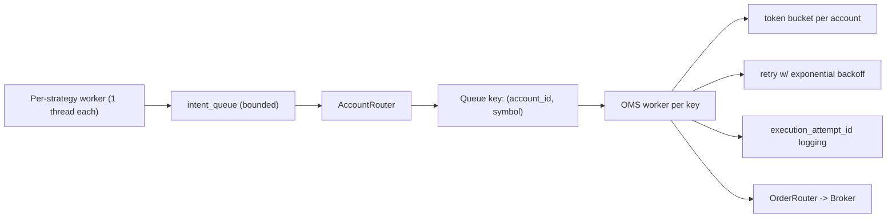
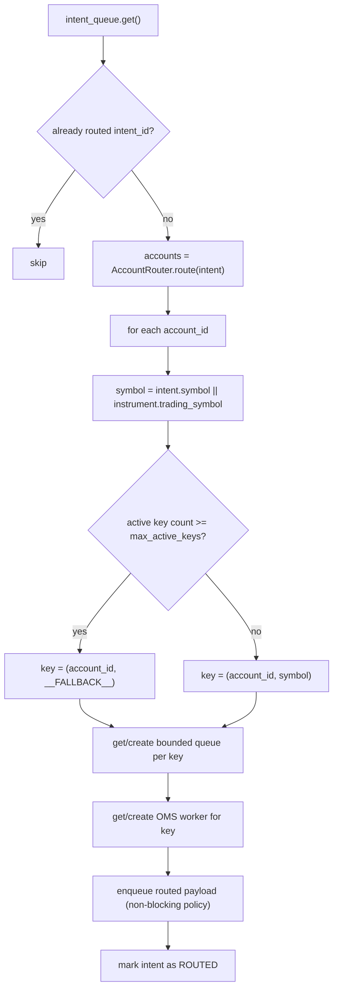
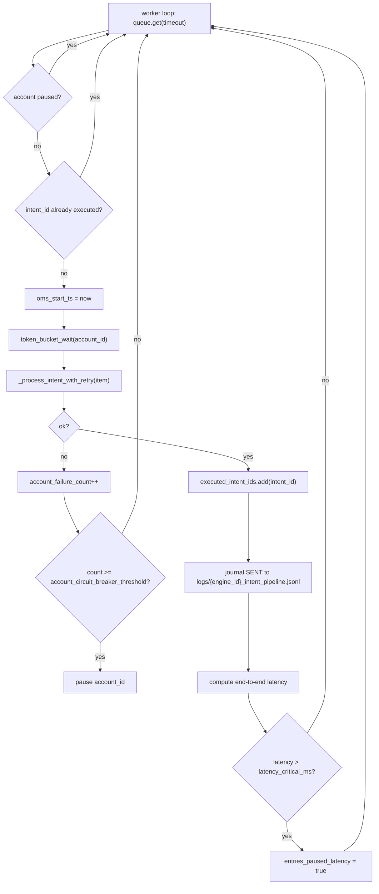

# OMS Flow

Order management: routing, per-account-symbol workers, token bucket, and broker handoff. Implemented in `core/engine/execution_engine.py` (delegated from `LiveEngine`).

See also: [retry_state_machine.md](retry_state_machine.md), [sequence_flow.md](sequence_flow.md), [watchdog.md](watchdog.md).

## Threaded fanout (overview)

## Intent routing and ordering

## OMS worker path (per account–symbol key)

## Key modules

| Module | Role |
|--------|------|
| `core/orderExecution/intent_store.py` | Intent lifecycle and dedupe |
| `core/orderExecution/account_router.py` | Account selection per intent |
| `core/orderExecution/order_router.py` | `process_intent`, `process_trade` |
| `core/orderExecution/risk_manager.py` | Pre-trade checks, realized PnL |
| `core/orderExecution/position_manager.py` | Positions from fills |
| `core/engine/execution_engine.py` | Queues, workers, token bucket, retries, watchdog hooks |
