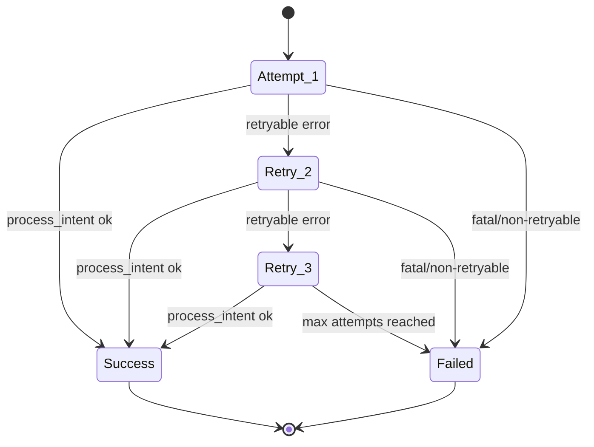

# Retry State Machine

OMS retry behavior inside `_process_intent_with_retry` (`core/engine/execution_engine.py`). Used after token-bucket wait on each account–symbol worker.

Parent context: [oms_flow.md](oms_flow.md) (worker path).

## Behavior summary

- Up to **three** attempts per routed intent payload.
- **Retryable** errors use exponential backoff between attempts.
- **Fatal / non-retryable** errors fail immediately.
- Repeated failures increment per-account failure count; at threshold the account is **paused** (circuit breaker). See [oms_flow.md](oms_flow.md).
- Each attempt logs an `execution_attempt_id` for pipeline tracing (`logs/{engine_id}_intent_pipeline.jsonl`).
