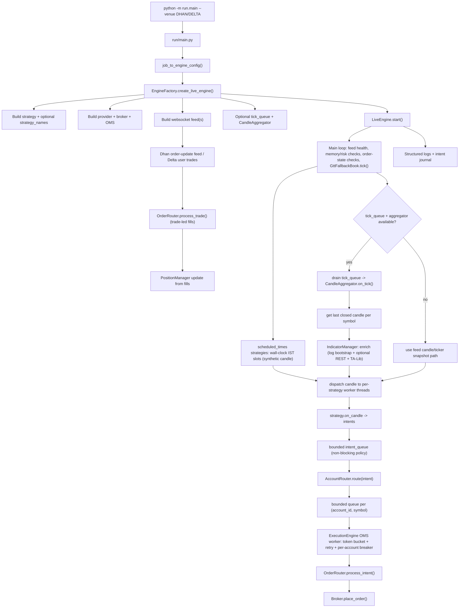

# Live Runtime Flow

Feed-driven live engine path from CLI to broker. See [module_map.md](module_map.md) for package layout and [oms_flow.md](oms_flow.md) for execution detail.

## Operational boundaries

- **`run/`** — Process entry, CLI, job → `EngineConfig` (`run/main.py` reads `ENGINE_JOBS` from `run/config.py`; `job_to_engine_config()` accepts the legacy multi-key job shape).
- **`core/engine/`** — Orchestration and lifecycle (`factory`, `live_engine`, `backtest_engine`, `execution_engine`, `indicator_manager`, `supervisor`).
- **`core/data/`** — Sources, providers, websocket feeds, `CandleService`, candle aggregation.
- **`core/strategies/`** — Signal generation (`on_candle`).
- **`core/orderExecution/`** — Intent lifecycle, risk, routing, position state.
- **`core/broker/internal/*`** — Maps orders/fills to broker APIs.
- **`utils/logger/`** and **`core/analytics/`** — Telemetry and reporting.

## Runtime notes

- **Candle delivery** is feed- or aggregator-driven (`DhanWebSocketFeed` / `DeltaWebSocketFeed`, optional `tick_queue` + `CandleAggregator`). `core/data/feeds/dummy_feed.py` is used by `run/dummy_live.py`.
- **`IndicatorManager`** (live) bootstraps history from engine `*_candles.log` when valid; if logs are missing, short, or invalid it may call **`IDataProvider.get_intraday`** (REST / broker historical path) before the first live bar — separate from the tick loop.
- Optional **offline indicator seed**: `utils/yfinance/nifty_yahoo.py` + `utils/yfinance/refresh_nifty_indicator_history.py` write `logs/indicators/NIFTY/{tf}/` (manual — not imported by the engine).
- **`PAPER`** uses the live data path with simulated execution.
- **Multi-strategy** live mode runs one worker thread per strategy.
- **Scheduled strategies** (e.g. BankNiftyBTST) use `strategy.scheduled_times` — no candle aggregator for that strategy; engine builds a synthetic candle from spot at the slot.
- **HYBRID_GTT** (`GttFallbackBook`): after Forever order placement, main loop polls quotes (WS + REST fallback) until ask/bid trigger → cancel GTT → resting LIMIT.
- **LEAPS exits/rollover** run on every closed 60m bar via `_run_exits_and_rollover`; entries remain gated on `should_evaluate` (RSI crossover).
- Queue growth is bounded at strategy, intent, and account-symbol stages.
