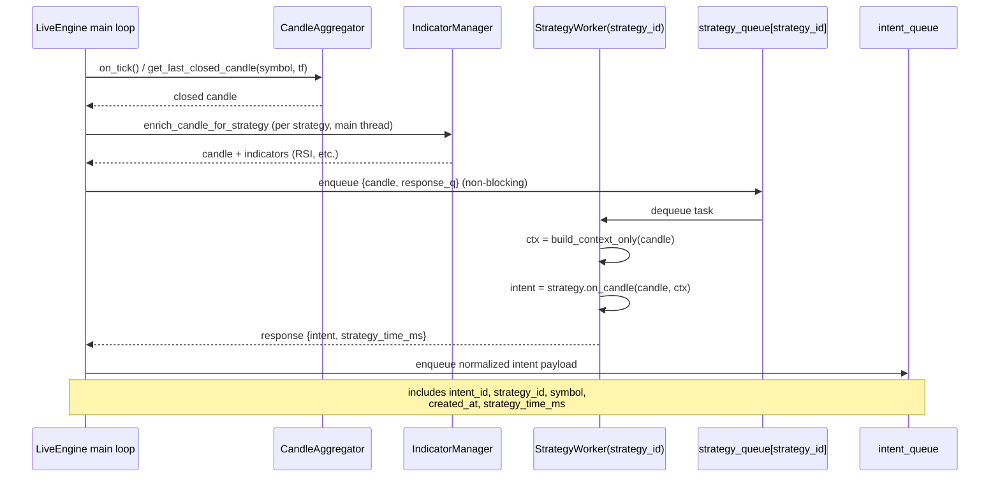
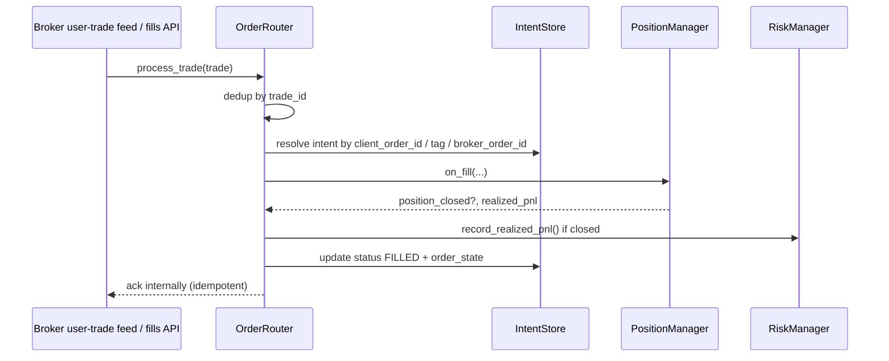
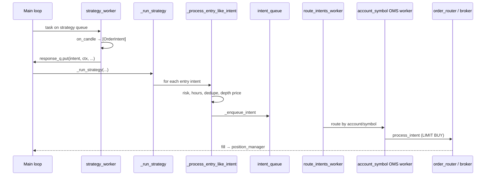

# Sequence Flows

Low-level message paths between engine components.

- [Candle → intent](#candle-to-intent)
- [Trade-led fills](#trade-led-fill-update)
- [Strategy → broker (entry handoff)](#strategy-to-broker-entry-handoff)

---

## Candle to intent

---

## Trade-led fill update

---

## Strategy to broker (entry handoff)

Main thread receives strategy worker response, runs risk/depth checks, then routes to OMS.

See [oms_flow.md](oms_flow.md) for routing and retry detail.
