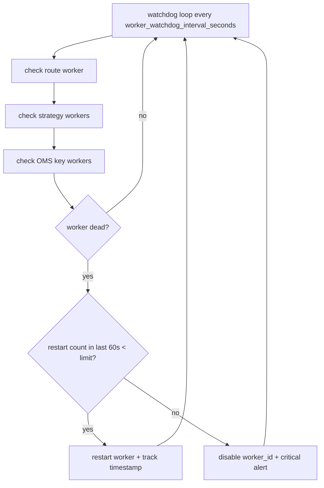

# Watchdog and Worker Recovery

`ExecutionEngine` runs a watchdog loop on `worker_watchdog_interval_seconds` to detect dead workers and restart or disable them.

Related: [oms_flow.md](oms_flow.md), [runtime_flow.md](runtime_flow.md).

## Workers monitored

| Worker | Purpose |
|--------|---------|
| Route worker | Drains `intent_queue`, fans out to account–symbol OMS queues |
| Strategy workers | One per `strategy_id`; run `on_candle` off main thread |
| OMS key workers | One per `(account_id, symbol)` (or fallback key); execute orders |

## Recovery policy

- If a worker thread is **dead**, restart it when restart count in the last **60s** is below the configured limit.
- If the limit is exceeded, **disable** that `worker_id` and emit a critical alert (manual intervention expected).
- Watchdog does not replace broker-side reconciliation; trade-led fills still arrive via order-update feeds ([sequence_flow.md](sequence_flow.md)).
